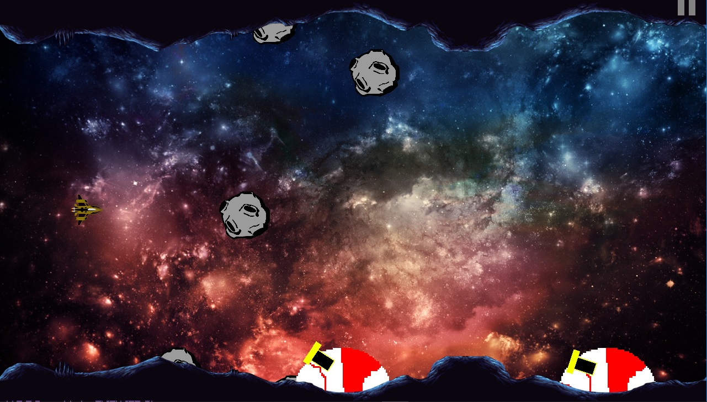
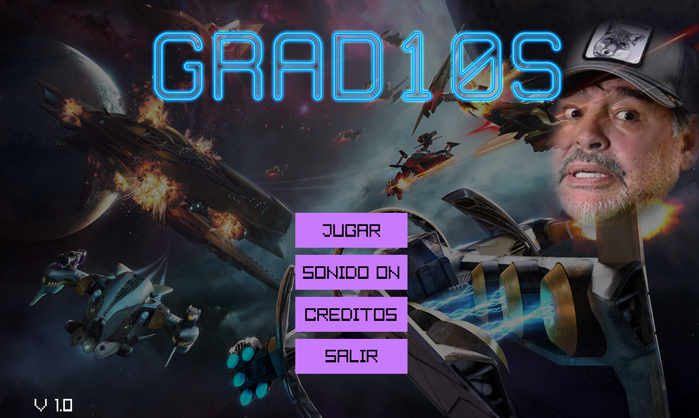
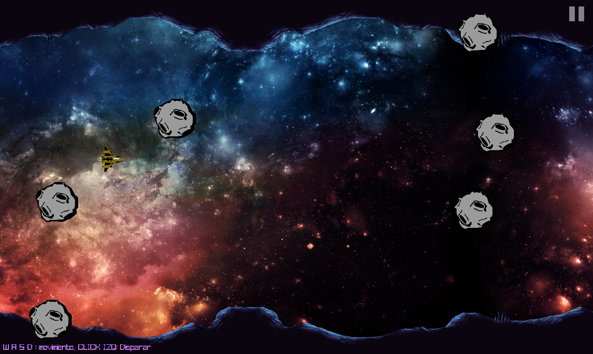
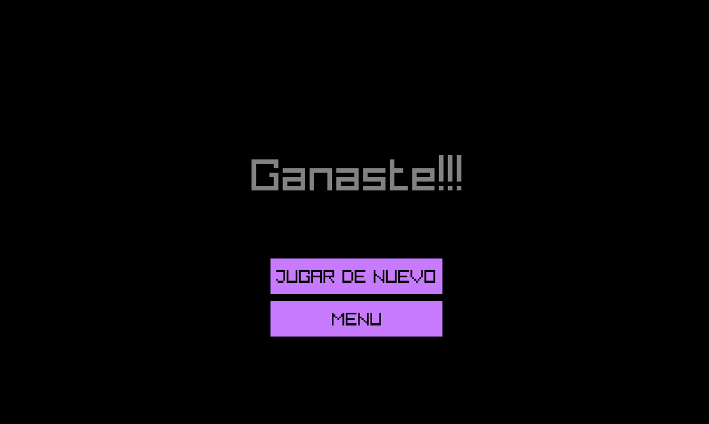

# GRAD10S

## Logo:

## Descripcion:
Juego basado en Gradius, popular videojuego de arcade. Gradius es un matamarcianos lanzado por Konami en 1985.

## Version 1.1 Lanzada!

agregamos las bombas y las maquinas que no dejan de apuntar al personaje para destruirlo de un bombazo. Esperamos les guste.

## Screenshot:

## Musica: 
- Realizada con BoscaCeoil.

## Sonidos:
- Realizados con Bfxr.

## Imagenes y assets:
- '[M13] Cave Tileset', Autor: Beast, https://opengameart.org/content/m13-cave-tileset.
- 'STARLINK BATTLE FOR ATLAS SPACESHIP SPACE BATTLE', sin autor, https://anoncraft.com/starlink-battle-for-atlas-spaceship-space-battle-21216/.
- 'Azul Rojo Galaxy Fantasía Espacio fondo de pantalla', sin autor, http://www.hdfondos.eu/preview/65932/1024/768.
- Sin titulo, Tony Rivera, https://www.clarin.com/deportes/futbol-internacional/diego-maradona-despues-triunfo-dorados-vendo-humo-vendo-trabajo_0_vGCzhB6lP.html.
- La nave, los asteroides y el disparo fueron creados con Adobe Illustrator y las imagenes modificadas con Adobe Photoshop.

## Autor: 
- Mariano Martinez.
## Colaborador:
- PatoDL

## Contacto: 
### Mariano:
- mariano_mcr92@hotmail.com
- marianomcr92@gmail.com

### Pato:
- github.com/PatoDL
- patodl.itch.io
- ig: @pato.dl
